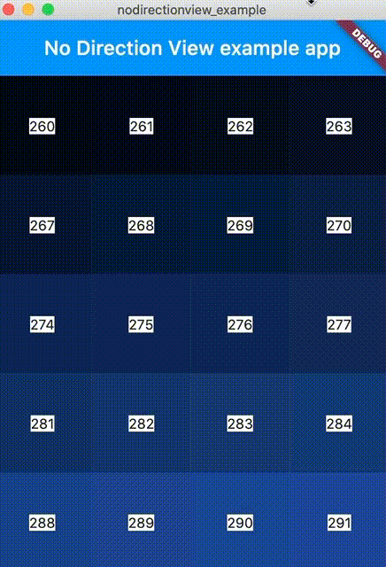
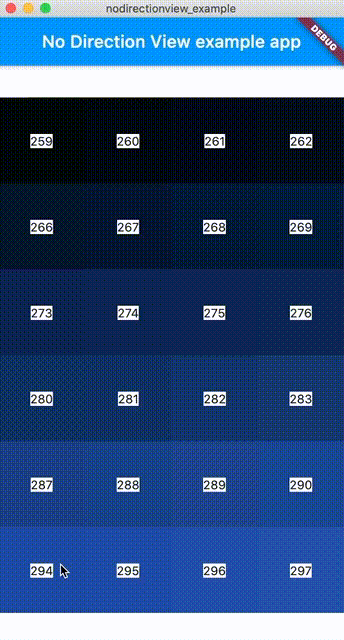

## flutter 无方向拖动视图

### 1. 引用
在pubspec.yaml中添加
```
    nodirectionview:
        git: https://github.com/MEnigma/nodirectionview.git
```
执行 flutter pub get


### 2. 注意事项

    子视图中不能包含ListView/GridView

### 3. demo
    如下图,
    蓝灰色为容器视图(NoDirectionView)所占区域,该区域尺寸有父视图控制
    白色区域为子视图所占空间,最大尺寸为父视图(NoDirectionView)所占区域
    子视图由Column+Raw嵌套,Column主轴为居中对齐
    子视图区域小于父视图大小


    下图
    子视图区域超过父视图大小

